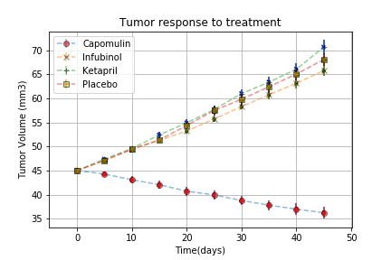
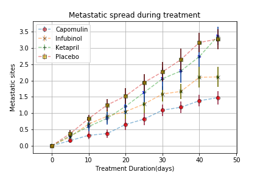
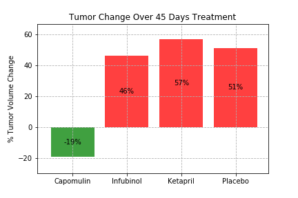
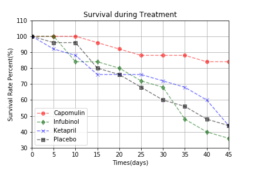

# Matplotlib-challenge

# Assignment - Pymaceuticals Inc
# Conclusions: 
 We observed three trends from “Pymaceuticals Inc” mice tumor treatment data:
 
1.	We pulled raw data from four mice tumor treatment groups(three drugs and one placebo) for analysis. Compared with the other two drugs and placebo treatment groups, Capomulin treatment group’s average tumor volume decreased from 45 mm3 to 36.23 mm3, about 19% decrease. The other three groups’ average tumor volume increased between 46% and 57%,  Ketapril group’s average tumor volumes increased most at 57%, which is worse than placebo group.

2.	All of four groups’ mice have metastatic spread during the treatment, Capomulin treatment group has least metastatic spread and Placebo group has the most metastatic spread.

3.	When compared the survival rate from first day of treatment to the 45 days, Capomulin treatment group’s mice has highest survival rate and Infubinol treatment group has the lowest survival rate.

4.	In conclusion,  Capomulin is a promising drug candidate for this kind of tumor warranting further investigation from this clinical trial's data analysis results.

While your data companions rushed off to jobs in finance and government, you remained adamant that science was the way for you. Staying true to your mission, you've since joined Pymaceuticals Inc., a burgeoning pharmaceutical company based out of San Diego, CA. Pymaceuticals specializes in drug-based, anti-cancer pharmaceuticals. In their most recent efforts, they've since begun screening for potential treatments to squamous cell carcinoma (SCC), a commonly occurring form of skin cancer.

As their Chief Data Analyst, you've been given access to the complete data from their most recent animal study. In this study, 250 mice were treated through a variety of drug regimes over the course of 45 days. Their physiological responses were then monitored over the course of that time. Your objective is to analyze the data to show how four treatments (Capomulin, Infubinol, Ketapril, and Placebo) compare.

To do this you are tasked with:

Creating a scatter plot that shows how the tumor volume changes over time for each treatment.
Creating a scatter plot that shows how the number of metastatic (cancer spreading) sites changes over time for each treatment.
Creating a scatter plot that shows the number of mice still alive through the course of treatment (Survival Rate)
Creating a bar graph that compares the total % tumor volume change for each drug across the full 45 days.
As final considerations:

You must use the Pandas Library and the Jupyter Notebook.
You must use the Matplotlib and Seaborn libraries.
You must include a written description of three observable trends based on the data.
You must use proper labeling of your plots, including aspects like: Plot Titles, Axes Labels, Legend Labels, X and Y Axis Limits, etc.
Your scatter plots must include error bars. This will allow the company to account for variability between mice. You may want to look into pandas.DataFrame.sem for ideas on how to calculate this.
Remember when making your plots to consider aesthetics!
Your legends should not be overlaid on top of any data.
Your bar graph should indicate tumor growth as red and tumor reduction as green. It should also include a label with the percentage change for each bar. You may want to consult this tutorial for relevant code snippets.
You must include an exported markdown version of your Notebook called  README.md in your GitHub repository.
See Example Solution for a reference on expected format. (Note: For this example, you are not required to match the tables or data frames included. Your only goal is to build the scatter plots and bar graphs. Consider the tables to be potential clues, but feel free to approach this problem

